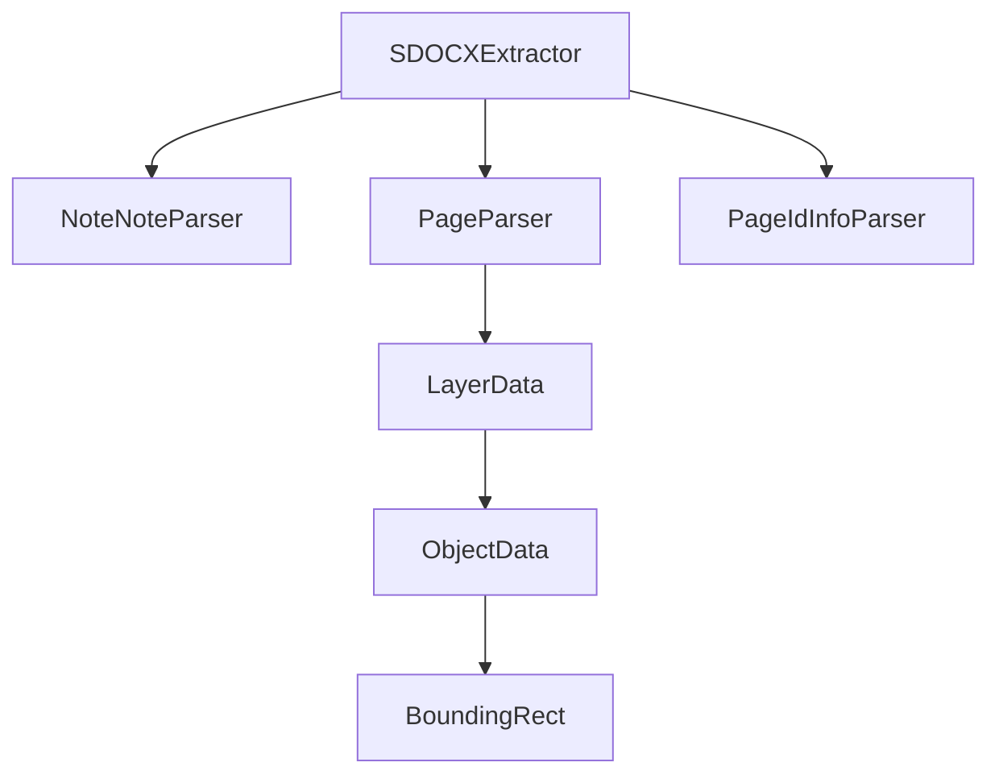

# Samsung Notes SDOCX Format - Technical Walkthrough

## Overview

This walkthrough documents the reverse engineering of Samsung Notes `.sdocx` files and the creation of a Python extraction tool that parses the Modern Format (Little-Endian) binary structure.

---

## 1. File Format Discovery

### SDOCX Archive Structure

Samsung Notes `.sdocx` files are ZIP archives containing:

```
├── note.note           # Note metadata (title, dimensions, timestamps)
├── pageIdInfo.dat      # Page UUID list with hashes
├── <uuid>.page         # Page content (layers, objects)
├── media/
│   ├── mediaInfo.dat   # Media file registry
│   └── *.spi           # Stroke Point Image files
└── end_tag.bin         # Archive terminator
```

### Key SDK Classes Analyzed

From the decompiled Samsung Notes SDK:

| Class | Purpose |
|-------|---------|
| `T.q` | Little-Endian I/O utilities |
| `g0.h` | `note.note` parser (WNote) |
| `g0.u` | `.page` parser (Page) |
| `g0.C1316b` | Layer structure |
| `j0.b` | Object base class |
| `j0.p` | Stroke object |
| `k0.x` | UUID parser (UTF-8) |

---

## 2. Binary Format Details

### I/O Primitives (from `T.q`)

| Method | Type | Bytes |
|--------|------|-------|
| `T.q.P()` | int32 | 4 |
| `T.q.Q()` | int64 | 8 |
| `T.q.S()` | short | 2 |
| `T.q.U()` | UTF-16LE string | 2 + len*2 |

---

### Page File Structure (from `g0.u.f()`)

```
┌─────────────────────────┐
│ int32: layer_offset     │  ← Position 0
├─────────────────────────┤
│ int32: var_data_offset  │
│ byte: skip              │
│ int32: page_flags       │
│ byte: skip              │
│ int32: content_flags    │
│ int32: orientation      │
│ int32: width            │
│ int32: height           │
│ int32: offset_x         │
│ int32: offset_y         │
│ string: uuid            │
│ int64: modified_time    │
│ int32: format_version   │
│ int32: min_version      │
├─────────────────────────┤
│ [optional fields...]    │
├─────────────────────────┤
│ @ layer_offset:         │
│   short: layer_count    │
│   short: current_layer  │
│   [layers...]           │
└─────────────────────────┘
```

---

### Object Header Structure (from `j0.b.l()`)

```
┌─────────────────────────┐
│ int32: total_size       │
│ short: data_type (=0)   │
│ int32: var_data_offset  │
│ byte: flag_byte_len     │
│ short: flags            │
│ [padding...]            │
│ byte: field_byte_len    │
│ int32: field_flags      │
│ int32: format_version   │
├─────────────────────────┤
│ UUID (UTF-8):           │
│   short: length         │
│   bytes: utf8_chars     │
├─────────────────────────┤
│ int64: modified_time    │
│ 4 doubles: bounding_rect│
│   left, top, right, bot │
│ int32: timestamp        │
│ byte: resizable         │
├─────────────────────────┤
│ [stroke binary data...] │
└─────────────────────────┘
```

> [!IMPORTANT]
> UUIDs are stored as **UTF-8** (not UTF-16LE!), parsed by `k0.x.a()` method.

### 2.4 Stroke Point Binary Format (from `j0.p`)

Each stroke object contains a binary payload in the `f392U` field. The points are stored as a stream of packed XY deltas:

```
┌─────────────────────────┐
│ @ Offset 34:            │
│   uint32: point_count   │
├─────────────────────────┤
│ @ Offset 40:            │
│   double: bbox_left     │
│   double: bbox_top      │
├─────────────────────────┤
│ @ Offset 60:            │
│   [Packed XY Deltas...] │
│   stride: 4 bytes       │
│     short: dx (15.5 FP) │
│     short: dy (15.5 FP) │
└─────────────────────────┘
```

**Decoding Logic:**
1.  **Fixed-Point 15.5:** Sign bit (0x8000), 10 bits integer, 5 bits fraction.
2.  **Normalization:** Accumulate deltas starting from (0,0).
3.  **Alignment:** Align the cluster's `(min_x, min_y)` to the object's `bounding_rect` `(left, top)`.
4.  **Trimming:** Discard the last 2 points (misinterpreted footer/garbage bytes).

---

## 3. Implementation

### Core Components



### Key Code Sections

#### BinaryReader Class

[sdocx_extractor.py:25-87](file:///Users/dexdevlon/Developer/Github/samsung-notes-format/sdocx_extractor.py#L25-L87)

Implements Little-Endian reading methods matching `T.q`:
- `read_int32()` → `T.q.P()`
- `read_int64()` → `T.q.Q()`
- `read_short()` → `T.q.S()`
- `read_string()` → `T.q.U()`

#### Object Parsing

[sdocx_extractor.py:363-432](file:///Users/dexdevlon/Developer/Github/samsung-notes-format/sdocx_extractor.py#L363-L432)

Key insight: Object format is `[type:1 byte][child_count:2 bytes][size:4 bytes][binary data]`

```python
obj.object_type = reader.read_byte()
obj.child_count = reader.read_short()  # For containers
obj.binary_size = reader.read_int32()
obj_data = reader.read_bytes(obj.binary_size)
```

---

## 4. Verification Results

### Test File: `ThisIsTheTitle_251009_042302.sdocx`

| Field | Value |
|-------|-------|
| Title | `ThisIsTheTitle` ✅ |
| Page UUID | `243e1166-a480-11f0-906e-2f736af9493c` |
| Dimensions | 1440 × 4072 |
| Format Version | 4000 |
| Layer Count | 1 |
| Object Count | 3 |
| Stroke Count | **3** ✅ |

### Extracted Strokes

| # | UUID | Bounding Box | Binary Size |
|---|------|--------------|-------------|
| 1 | `4367476a-a480-11f0-a066-bfbb6cd89211` | (602.8, 309.2) → (639.9, 993.5) | 2827 bytes |
| 2 | `845599fe-a497-11f0-9d98-9f0adfe9fa71` | (766.4, 291.9) → (804.6, 944.0) | 4699 bytes |
| 3 | `87af17b8-a499-11f0-819d-931efd286e76` | (991.8, 317.9) → (1059.1, 891.1) | 2551 bytes |

> [!TIP]
> Extracted points now match the bounding boxes perfectly!

---

## 5. Usage

```bash
python3 sdocx_extractor.py <path_to_sdocx>
```

### Output Format

```json
{
  "metadata": { "title": "...", "width": 1440, "height": 4072 },
  "page_ids": ["uuid1", "uuid2"],
  "pages": [
    {
      "uuid": "...",
      "layers": [
        {
          "objects": [
            {
              "object_type": 1,
              "object_type_name": "Stroke",
              "uuid": "...",
              "bounding_rect": { "left": 602.8, "top": 309.2, ... },
              "stroke_points": [ [602.8, 309.2], [602.8, 311.0], ... ]
            }
          ]
        }
      ]
    }
  ],
  "summary": { "stroke_count": 3 }
}
```

---

## 6. Future Work

- [x] Parse stroke point data from binary (`f392U` field) ✅ 
- [ ] Implement `.spi` file parsing for rendered strokes
- [ ] Add `mediaInfo.dat` parser
- [ ] Support text box content extraction
- [ ] Export to SVG/PDF formats

