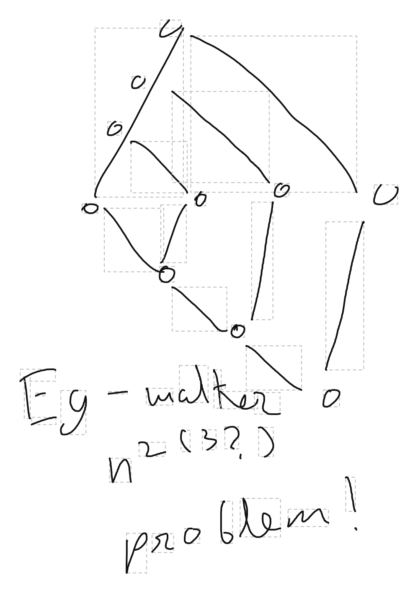

# samsung-notes-format

Reverse-engineered reader for the handwriting in Samsung Notes `.sdocx` files. Decodes the on-disk pen-stroke format and renders the strokes back out.

This is a research repo, focused on the stroke geometry. For a more complete library that also decodes pressure, tilt, and color and renders full ink, see [twangodev/sdocx](https://github.com/twangodev/sdocx).



- Write-up (how and why): https://musaab.io/posts/2026/reverse-engineering-samsung-notes/
- Format reference: [RESEARCH.md](RESEARCH.md)

## Usage

```
python3 render.py note.sdocx [out.svg]
```

Parses the note, decodes every stroke, and writes an SVG with each stroke drawn inside its stored bounding box. The whole pipeline is one self-contained file, ~190 lines.

## Other files

Older research files, kept for reference rather than as the canonical implementation. `render.py` is the clean, correct one; treat the rest as the trail it was built from.

- `sdocx_extractor.py`: fuller extractor that dumps all metadata to JSON. Its delta decode is a slight simplification (5 integer bits instead of the full 10); the output is identical on real handwriting, but `render.py` has the exact decode.
- `plot_strokes.py`: earlier SVG renderer.
- `artifacts/debugging/`: scratch scripts from working the format out; they try several wrong encodings before the right one.
- `sdocxFiles/`, `extracted_sdocx/`: sample notes.
- `blog-artifacts/`: figures and the comparison harness for the write-up.
- `*.png`, `Screenshot_*.jpg`: leftover render and comparison artifacts from the research, kept as a rough record of progress rather than cleaned out (`example.png` is the one used above).

## Notes

Independent implementation for interoperability and research. The repo contains no Samsung binaries or decompiled code, only original code and the documented format. Samsung Notes is a trademark of Samsung Electronics. The code here is MIT-licensed (see [LICENSE](LICENSE)).
